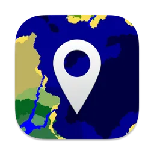

# Alidade

Navigate and explore your Minecraft Java worlds

**Alidade** is a small maps app for Mac, iPhone, and iPad that lets you
browse your various Minecraft Java worlds. Jump to a coordinate and view
the surrounding world, and pin your favorite locations.

> **Note**  
> Alidade is prerelease software. The current feature set, design, and
> overall functionality is not final and will change over time. Proceed
> with caution!

## Why make Alidade?

The Minecraft community has made countless seed mapping tools and
libraries such as Chunkbase, Mineatlas, and Amidst. These tools work
great on the desktop, and they will likely suffice for you. However, they
don't address or solve the things I look for in an seed map app for my
personal use cases, which include:

- A native app that works across Mac, iPhone, and iPad, tuned for each
  platform, respectively
- Pinning common or favorite locations I visit frequently
- Deep integrations into the Apple ecosystem
- A "file over app" approach, where pinned locations, worlds I explore
  frequently, etc., are all save in a simple JSON file
  
Alidade isn't being built to strictly _compete_ with the other tools
out there, but it exists as an addition to that market.

## Build from source

**Requirements**  
- Xcode 16 or later
- macOS 15.0 Sequoia or later

Clone this repository using `git clone --recursive`, then open the
`Alidade.xcworkspace` file in Xcode. Select the **Alidade** target to
build and run the project for your targeted platform.

> **Note**  
> While Apple Vision Pro is listed as a supported target, support for this
> platform hasn't been thoroughly tested.

## License

The source code to Alidade is licensed under the Mozilla Public License
v2.0. For more information on your rights, refer to the license terms in
LICENSE.txt or visit https://www.mozilla.org/en-US/MPL/2.0/.

**Alidade** is made possible by the following open source libraries:

- [**Cubiomes**](https://github.com/Cubitect/cubiomes) - MIT License
- [**Zoomable**](https://github.com/ryohey/Zoomable) - MIT License
